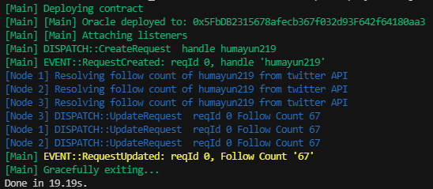

# Twitter Follower Count Oracle

## What's this
This oracle or contract brings off-chain twitter follow count to on-chain  using consenses mechanism. An event is generated when a request for follower count is called. The off-chain nodes listen for these events and call the twitter API for the follow count and send this data to oracle. When a qourum is reached, the follower counts from different services are averaged and this value is emitted through the event.


## How to run
Start by installing required packages
`yarn install` or `npm install`

And then run the scripts/mock.js script with hardhat
`yarn hardhat run scripts/mock.js` or 
`npx hardhat run scripts/mock.js` 

### (Optional) Twitter API
If you've access to twitter API, .env.sample with .env and fill the OAuth 2.0 twitter API key. You can also set `TWITTER_API_KEY` enviroment variable from cmd.

### Understanding the output
[

The scripts deploys the contract and creates a request for follow count.
The contract emits RequestCreated event which the script intercepts and run 3 nodes for consensus to fetch the follow count. These nodes submit their numbers by calling UpdateRequest, after the quorum is reached the final follow count emitted through an RequestUpdated.

## Other commands
Since this project is bootstraped from sample hardhat project. You can also run standard harthat commands

```shell
npx hardhat accounts
npx hardhat compile
npx hardhat clean
npx hardhat test
npx hardhat node
npx hardhat help
```
